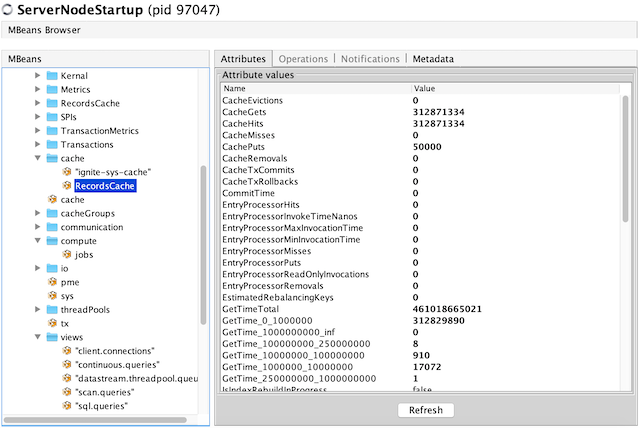
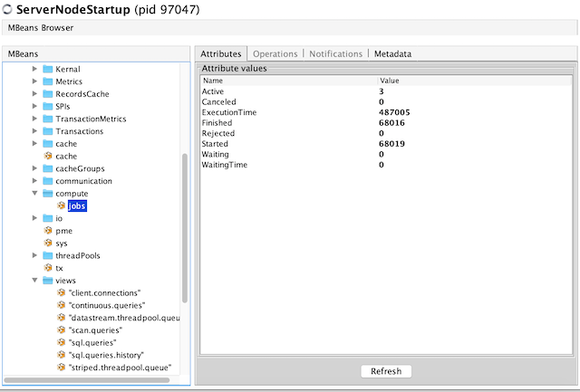
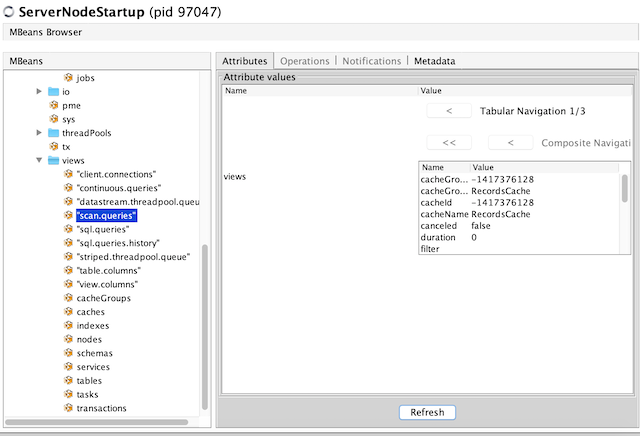

# Apache Ignite Metrics Demo

The demo showcases how to enable metrics exporters available in Ignite 2.8 and later versions and observer the cluster
state via metrics registries and system views. Follow the steps to get the demo working on your end.

## Launching Demo

* Start an Ignite server node with `ServerNodeStartup`. By default, the server enables
`JmxMetricExporterSpi` only but has a commented-out lines that show how to switch on other types of exporters.

* Launch VisualVM - you can simply execute `jvisualvm` command in your terminal or might need to pass a direct path to 
the tool executable such as `/Library/Java/JavaVirtualMachines/jdk1.8.0_191.jdk/Contents/Home/bin/jvisualvm`.

* Ensure that VisualVM-MBeans plugin is installed - navigate to `Tools -> Plugins` of VisualVM app.

* Select `ServerNodeStartup` in VisualVM to connect to the running process. Go to `MBeans` tab and unfold the 
structure under `org.apache.<node_id>` path.

* Launch `IgniteMetricsDemo` that creates a sample caches and executes key-value requests with compute tasks 
indefinitely.

## Observing Metrics With VisualVM

Use VisualVM already connected to the `ServerNodeStartup` process to observer how the following metrics are changing
under `org.apache.<node_id>` path (click "Refresh" button on the VisualVM screens to get the interface updated):
* `cache.RecordsCache` (cache registry) - check CacheGets, CacheHits, CachePuts and other attributes.

* `compute.jobs` (compute tasks registry) - check active, finished, executiontime and other attributes.

* `views."scan.queries"` (scan queries system view) - double-click on "Value" cell of the "views" row to see detailed output.

